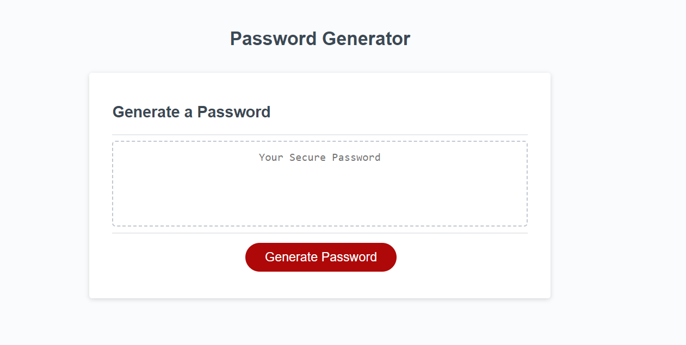

# password-genv1.1

## Advanced CSS: Password Generator

## Objective:

Create an application that an employee can use to generate a random password based on criteria they've selected. This app will run in the browser, and will feature dynamically updated HTML and CSS powered by JavaScript code. It will have a clean and polished user interface that is responsive, ensuring that it adapts to multiple screen sizes. 

The password can include special characters. If you're unfamiliar with these, see this list of Password Special Characters from the [OWASP Foundation](https://owasp.org/www-community/password-special-characters). 

## User Story: 

AS AN employee with access to sensitive data
I WANT to randomly generate a password that meets certain criteria
SO THAT I can create a strong password that provides greater security

## Summary of the Code 

1.	It declares a variable generateBtn that references the HTML element with the ID "generate".
2.	The generatePassword() function is defined, which prompts the user to enter a desired password length and asks for confirmation on including lowercase, uppercase, numeric, and special characters.
3.	It performs input validation to ensure the password length is within the range of 8 to 128 and that at least one character type is selected. If the input is invalid, appropriate alerts are displayed, and the function returns.
4.	The function then defines character sets for lowercase, uppercase, numeric, and special characters.
5.	Based on the user's selection, the available character set is built by concatenating the selected character types.
6.	A password string is initialized.
7.	A loop runs length times, randomly selecting a character from the available character set and appending it to the password string.
8.	The generated password is returned.
9.	The writePassword() function is defined, which calls generatePassword() to obtain the generated password and updates the value of the HTML element with the ID "password" to display the generated password.
10.	An event listener is added to the generate button so that when it is clicked, the writePassword() function is executed.

## Tasks Completed: 

Created the GIT repository named password-genv1.1

Pushed the code the repository password-genv1.1

Hosted the index.html in GitHub Pages

## Links

URL to the GitHub repository: https://github.com/arundvp/password-genv1.1

URL to my deployed webpage: https://arundvp.github.io/password-genv1.1/

